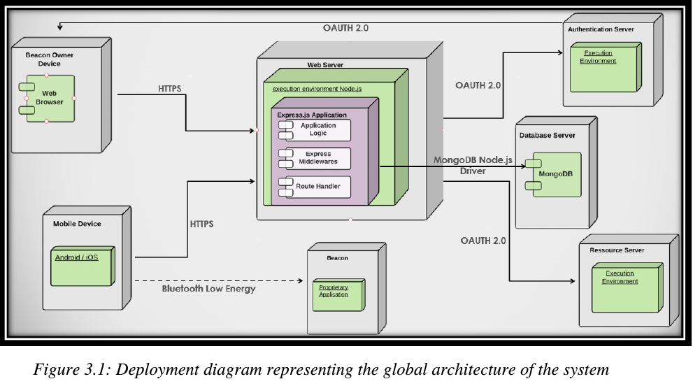
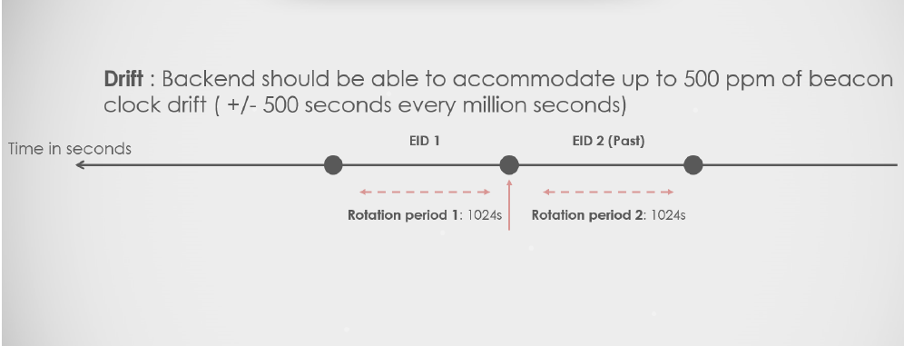

# Eddystone-Beacons-Registration-and-Resolution-Service
Engineering Graduation Project

# Objective

This work is an implementation and test of an open source RESTful web service to register and
resolve Eddytsone-EID beacons.## Architecture

## Architecture

In this Architecture, we develoepd the web service, a dashboard for a beacon owner to register and modify EID beacons and an Android mobile app to test Resolution. A beacon simulation have been used to test all the functionnalities.

## Functional Requirements

 1. Allow a beacon owner to authenticate.
 2. Register Eddystone-EID beacons.
 3. Resolve-EID beacons.
 4. Activate, deactivate or delete a registered beacon.

## Webservice Routes

1. https://beacon-resolution-service.herokuapp.com/register
2. https://beacon-resolution-service.herokuapp.com/resolve
3. https://beacon-resolution-service.herokuapp.com/modify
4. https://beacon-resolution-service.herokuapp.com/authenticate

Every route is handled by a js file in the “routes” folder that contains minimum logic.
Basically, a file in the routes folder retrieves the data from requests and calls a controller function.
Once output is ready, it fires the response to the requester.

## Registration.js Controller

The first controller is “Registration.js”. In this controller, we handle a:
1. Get request on the corresponding route to retrieve the server parameters.
2. Post request on the corresponding route to register the beacon. Basically, it consists in
verifying the sent data, compute the server’s ephemeral id version, encrypt it and compare
it with the beacon’s version. If results match then beacon is registered. In this route, the
modification secrets are computed also before putting data in database. Finally, we launch
a thread that keeps recomputing the ephemeral id every time period depending on the
requester sent rotation period. This is handled by “getBroadcastedEID.js”.
The second controller is “Resolution.js”. In this controller, we handle a:
3. Post request to resolve the beacon. Sent data is verified in a first step then the server parses
the database looking for an ephemeral id match. Response is fired in function of that
database search request.

## Resolution.js Controller

The second controller is “Resolution.js”. In this controller, we handle a:

1. Post request to resolve the beacon. Sent data is verified in a first step then the server parses
the database looking for an ephemeral id match. Response is fired in function of that
database search request.

## Modifictaion.js Controller

The third controller is “Modification.js”. In this controller, we handle a:
1. Post request to handle deactivation
2. Post request to handle activation
3. Post request to handle deletion

## Dealing With Drift

Every time we update the EID of a beacon, we are going to compute the time passed in seconds
since registration. For every 2000 seconds of this interval we have a maximum drift of one second.
We check then how many rotation periods in those drifted seconds by dividing that value over the
number of seconds in an interval. to decide how many past and future EIDs to compute. Finally,
we compute the EIDs and store them in the database.
Once we have the exact EID and the list of past/future EIDs, every time we receive a resolution
request we are going to look through these and try to map the EID to a real beacon ID and send
back a response to the client.

## Elliptic Curve Cryptography 
1. Crypto API for Node.js 
2. Elliptic curve secp256k1 (bitcoin curve)

## Testing 

In order to test the implemented service, we will use: 

1. Beacon owner dashboard testing app to perform registration and resolution requests (check owner_dash branch)
2. Android Testing Mobile App to detect beacon signal and resolve it with the webservice (check mobile_app_test branch)
3. Beacon simulator app on Play Store.

Registration: https://www.youtube.com/watch?v=ynssouZWB0o&t=89s
Resolution: https://www.youtube.com/watch?v=f8EUPED3Z-0 

